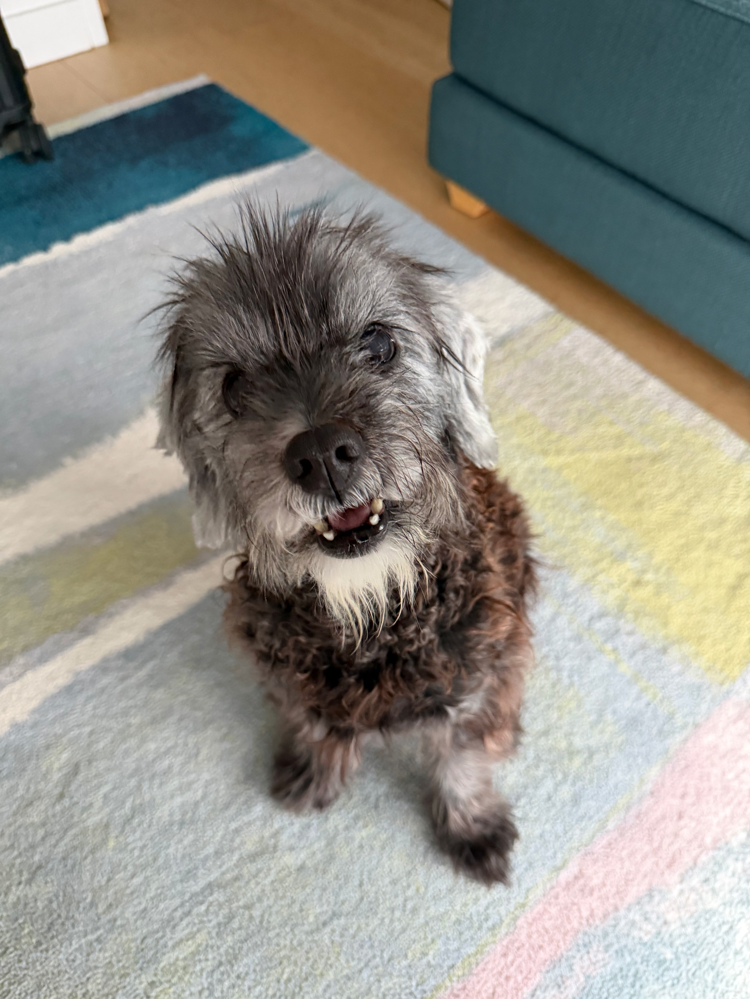

# PP Monster Tracker



A simple iOS app for logging your dog's pees and poops — because sometimes you just need to know.

## The Origin Story
On August 8, 2026, I picked up Bruce — an 8-year-old foster dog from Texas, courtesy of True North Rescue. I had zero intel on his potty-training history, so for the first few days I treated my apartment like a minefield.

Reader, it was a minefield. Two accidents in 72 hours: one in the building elevator hall (a real crowd-pleaser), one in my kitchen. Housetraining gap? Side effect of his post-heartworm medication? Was I walking him too much, or not enough? No idea. No data.

So I did what any reasonable person does at 6am with a groggy dog and rising anxiety: I started logging every bathroom break in the Notes app. This worked exactly as well as you'd expect for a dog going out every two hours — a wall of timestamps that's miserable to scroll through when you're trying to spot a pattern at midnight.

What I actually needed was an app. Two taps: pee, poop, done. So, with Claude's help, I built one. PP Monster Tracker logs bathroom breaks with a couple of button presses, timestamps and locations automatically, and even nags me with a reminder when it's probably walk time.

The twist: the frequent trips were just a medication side effect, not a housetraining problem. All that paranoia mostly meant Bruce (and I) took a lot of extra walks and met most of the neighborhood. These days he's done fostering — he's a full-time, fully adopted Brooklyn local. :)

## Project Structure

```
PPMonsterTracker/
├── PPMonsterTrackerApp.swift   # App entry point; sets up the SwiftData model container
├── ContentView.swift           # Main screen — summary cards, quick log buttons, history list
├── SplashView.swift            # Launch splash screen
├── BathroomEvent.swift         # SwiftData model, plus the EventKind/PeeAmount/PoopConsistency enums
├── LogEventSheet.swift         # Sheet for logging a new pee/poop, with location capture
├── EventEditView.swift         # Sheet for editing or deleting a past log entry
├── LocationManager.swift       # Thin wrapper around CoreLocation for tagging events with a location
├── NotificationManager.swift   # Schedules the "time for a walk" reminder 3 hours after the last log
└── Assets.xcassets/            # App icon, splash image, accent color

PPMonsterTrackerTests/          # Unit tests (Swift Testing)
PPMonsterTrackerUITests/        # UI tests (XCUITest)
```

